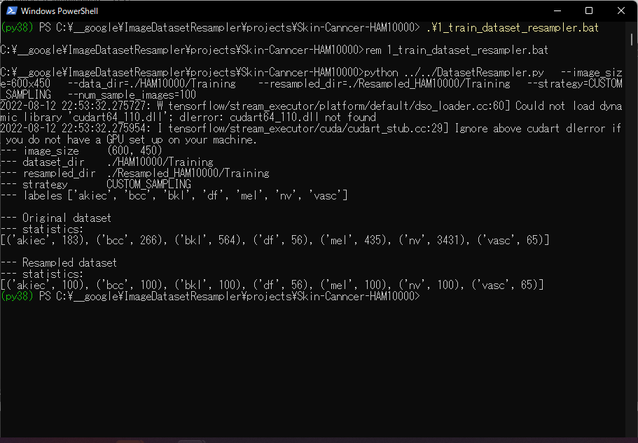
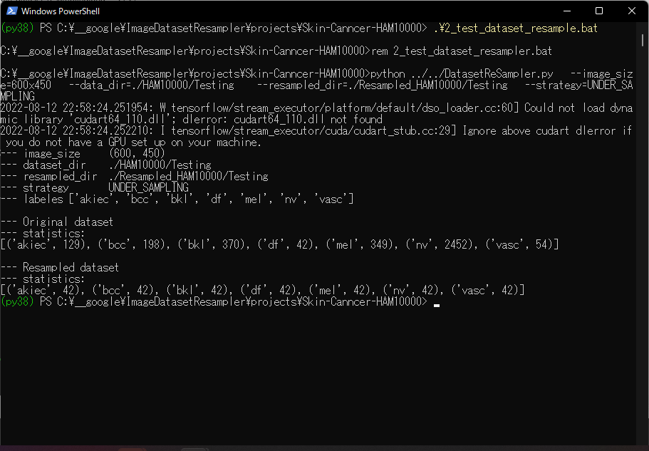
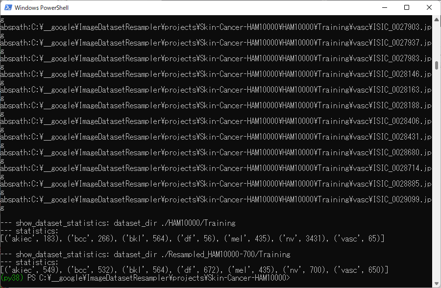
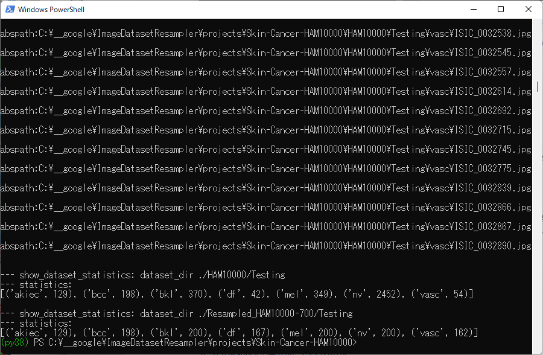

<h2>
ImageDatasetResampler (Updated: 2022/08/20)
</h2>
This is a simple Image Dataset Resampling Tool to resample original
image dataset, which supports the following strategies: 
Under_Sampling, 
Mean_Sampling,  
Over_Sampling,  
Custom_Sampling. 
 
We use Python 3.8 and Tensorflow 2.8.0 environment on Windows 11.
 
In cases of Mean, Over and Custom Samplings, we use <a href="./OfflineDataSetAugmentor.py">OfflineDataSetAugmentor</a> class, in which
<pre>
tf.keras.preprocessing.image.ImageDataGenerator
</pre>
is used to augment images in minority classes.
<h2>
1 Project 
</h2>
<h3>
1.1 Skin-Cancer-HAM10000
</h3>
The dataset <b>Skin-Cancer-HAM10000</b> has been taken from the following web site:

The HAM10000 dataset, a large collection of multi-source dermatoscopic images of common pigmented skin lesions

Harvard edu dataset:

 https://dataverse.harvard.edu/dataset.xhtml?persistentId=doi:10.7910/DVN/DBW86T

HAM10000 folder has Testing and Training subfolders, and they have classified subfolders
of akiec, bcc, bkl, df, mel, nv, and vasc as shown below:

<pre>
HAM10000
├─Testing
│  ├─akiec
│  ├─bcc
│  ├─bkl
│  ├─df
│  ├─mel
│  ├─nv
│  └─vasc
└─Training
    ├─akiec
    ├─bcc
    ├─bkl
    ├─df
    ├─mel
    ├─nv
    └─vasc
</pre>
Training dataset has been reconstructed from 
  HAM10000_images_part_1.zip and HAM10000_metadata.tab in Harvard edu dataset above:

Training dataset has been reconstructed from 
  HAM10000_images_part_2.zip and HAM10000_metadata.tab in Harvard edu dataset above:

<h3>
1.2 Resampling Skin-Cancer-HAM10000
</h3>
Skin-Cancer-HAM10000 dataset is a typical imbalanced dataset.
 
<h3>
1.2.1 Resampling training dataset
</h3>
Run the following command: 
<pre>
./1_train_dataset_resampler.bat
</pre>
<pre>
rem 1_train_dataset_resampler.bat
python ../../DatasetSampler.py ^
  --image_size=600x450 ^
  --data_dir=./HAM10000/Training  ^
  --resampled_dir=./Resampled_HAM10000/Training ^
  --strategy=CUSTOM_SAMPLING ^
  --num_sample_images=100
</pre>
Console output: 

 
<h3>
1.2.2 Resampling tesing dataset
</h3>
Run the following command: 
<pre>
./2_test_dataset_resampler.bat
</pre>
<pre>
rem 2_test_dataset_resampler.bat
python ../../DatasetReSampler.py ^
  --image_size=600x450 ^
  --data_dir=./HAM10000/Testing  ^
  --resampled_dir=./Resampled_HAM10000/Testing ^
  --strategy=UNDER_SAMPLING 
</pre>
Console output: 

<h3>
1.2.3 Download Resampled_HAM10000
</h3>
You can download the generated <b>Skin Cancer Resampled_HAM10000</b> dataset from the following google drive: 
 <a href="https://drive.google.com/file/d/1OqRiuFArflpw-8Anm2UV4EdyfS77ANTA/view?usp=sharing">Resampled_HAM10000.zip</a>

<!--
  -->
<h3>
1.3 Resampling Skin-Cancer-HAM10000-700
</h3>
You can also generate other Resampled dataset from Skin-Cancer-HAM10000 dataset.
 
<h3>
1.3.1 Resampling training dataset
</h3>
Run the following command to generate Resampled-HAM10000-700/Training dataset: 
<pre>
./1_train_dataset_resampler_700.bat
</pre>
<pre>
rem 1_train_dataset_resampler.bat
python ../../DatasetSampler.py ^
  --image_size=600x450 ^
  --data_dir=./HAM10000/Training  ^
  --resampled_dir=./Resampled_HAM10000-700/Training ^
  --strategy=CUSTOM_SAMPLING ^
  --num_sample_images=700
</pre>
Console output: 

 
<h3>
1.3.2 Resampling tesing dataset
</h3>
Run the following command: 
<pre>
./2_test_dataset_resampler_700.bat
</pre>
<pre>
rem 2_test_dataset_resampler.bat
python ../../DatasetReSampler.py ^
  --image_size=600x450 ^
  --data_dir=./HAM10000/Testing  ^
  --resampled_dir=./Resampled_HAM10000-700/Testing ^
  --strategy=CUSTOM_SAMPLING ^
  --num_sample_images=200
</pre>
Console output: 

<h3>
1.2.3 Download Resampled_HAM10000-700
</h3>
You can download the generated <b>Skin Cancer Resampled_HAM10000-700</b> dataset from the following google drive: 
<a href="https://drive.google.com/file/d/1e1LaKTJ6z3Hst-U6IfHqX8gMP76jPKCa/view?usp=sharing">
Resampled_HAM10000-7000.zip
</a>
