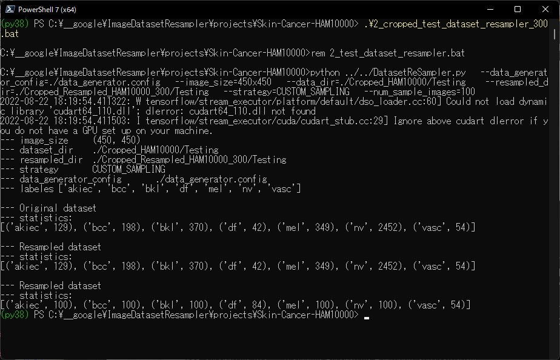

<h2>
ImageDatasetResampler (Updated: 2023/04/02)
</h2>
This is a simple <b>Image Dataset Resampling Tool</b> to resample original
image dataset, which supports the following strategies: 
UNDER_SAMPLING, 
MEAN_SAMPLING,  
OVER_SAMPLING,  
CUSTOM_SAMPLING. 

This tool will be helpful to generate a balanced dataset from an imbalanced image dataset by our resampling strategies. 
  
We use Python 3.8 and Tensorflow 2.8.0 environment on Windows 11.
 
In cases of MEAN, OVER and CUSTOM SAMPLING strategies, we use <a href="./OfflineDataSetAugmentor.py">OfflineDataSetAugmentor</a> class, in which
<pre>
tf.keras.preprocessing.image.ImageDataGenerator
</pre>
is used to augment the images in minority classes. 
 

<li>
2022/08/21: Modified to reset radom_seeds, and to use a seed parameter 
 in generate method of OfflineDatasetAugmentor class.
</li>
<li>
2022/08/22: Added <a href="./SquareRegionImageCropper.py">SquareRegionImageCropper</a> class to crop maximum square region from the original images.
</li>
<li>
2022/08/22: Added a script file to create <b>Cropped_HAM10000</b> dataset, and <b>Cropped_Resampled_HAM10000_300</b> dataset.
</li>
<li>
2023/04/01: Modified commadline resampling bat file to specify --image_format argument.
</li>
<li>
2023/04/01: Added resamling example AML to projects.
<pre>
The AML image dataset used here has been taken from the following web site;
CANCER IMAGING ARCHIVE
https://faspex.cancerimagingarchive.net/aspera/faspex/external_deliveries/77?passcode=a6be8bf0a97ddb34fc0913f37b8180d8f7d616a7

Package - AML-Cytomorphology
From:
Natasha Honomichl
To:
help@cancerimagingarchive.net 
CC (on download):
Natasha Honomichl
Date Sent:
17 Feb 2021 01:11 PM
</pre>
 
</li>

 
<h2>
1 Project:Skin-Cancer-HAM10000
</h2>
<h3>
1.1 Skin-Cancer-HAM10000
</h3>
The dataset <b>Skin-Cancer-HAM10000</b> has been taken from the following web site: 

The HAM10000 dataset, a large collection of multi-source dermatoscopic images of common pigmented skin lesions

Harvard edu dataset: 

 https://dataverse.harvard.edu/dataset.xhtml?persistentId=doi:10.7910/DVN/DBW86T

 
HAM10000 folder has Testing and Training subfolders, and they have classified subfolders
of akiec, bcc, bkl, df, mel, nv, and vasc as shown below:

<pre>
HAM10000
├─Testing
│  ├─akiec
│  ├─bcc
│  ├─bkl
│  ├─df
│  ├─mel
│  ├─nv
│  └─vasc
└─Training
    ├─akiec
    ├─bcc
    ├─bkl
    ├─df
    ├─mel
    ├─nv
    └─vasc
</pre>
Training dataset has been reconstructed from  
  <b>HAM10000_images_part_1.zip and HAM10000_metadata.tab</b> in Harvard edu dataset above:
 

Testing dataset has been reconstructed from  
  <b>HAM10000_images_part_2.zip and HAM10000_metadata.tab</b> in Harvard edu dataset above:
 

<h3>
1.2 Resampling Skin-Cancer-HAM10000
</h3>
As you may know, Skin-Cancer-HAM10000 dataset is a typical imbalanced dataset, so we would like to create a balanced dataset
by resampling images from the orginal HAM10000 dataset.
 
<h3>
1.2.1 Resampling training dataset
</h3>
Run the following command: 
<pre>
./1_train_dataset_resampler.bat
</pre>
<pre>
rem 1_train_dataset_resampler.bat
python ../../DatasetSampler.py ^
  --data_generator_config=./data_generator.config ^
  --image_size=600x450 ^
  --data_dir=./HAM10000/Training  ^
  --resampled_dir=./Resampled_HAM10000/Training ^
  --strategy=CUSTOM_SAMPLING ^
  --num_sample_images=100
</pre>
Console output: 

 
<h3>
1.2.2 Resampling tesing dataset
</h3>
Run the following command: 
<pre>
./2_test_dataset_resampler.bat
</pre>
<pre>
rem 2_test_dataset_resampler.bat
python ../../DatasetReSampler.py ^
  --data_generator_config=./data_generator.config ^
  --image_size=600x450 ^
  --data_dir=./HAM10000/Testing  ^
  --resampled_dir=./Resampled_HAM10000/Testing ^
  --strategy=UNDER_SAMPLING 
</pre>
Console output: 

<h3>
1.2.3 Download Resampled_HAM10000
</h3>
You can download the generated <b>Skin Cancer Resampled_HAM10000</b> dataset from the following google drive: 
 <a href="https://drive.google.com/file/d/1OqRiuFArflpw-8Anm2UV4EdyfS77ANTA/view?usp=sharing">Resampled_HAM10000.zip</a>

<!--
  -->
<h3>
1.3 Apply SquareRegionImageCropper to HAM10000
</h3>
You can generate Square-Region-Cropped HAM10000 dataset from Skin-Cancer-HAM10000 dataset by using
<a href="./SquareRegionImageCropper.py">SquareRegionImageCropper</a>.
 
<h3>
1.3.1 ImageSquareRegionCropper
</h3>
Run the following command to create Cropped_HAM10000 dataset from the original HAM10000: 
<pre>
./0_create_cropped_image_dataset.bat
</pre>
<pre>
rem 0_create_cropped_image_dataset.bat
python ../../SquareRegionImageCropper.py ^
  ./HAM10000/Training ^
  ./Cropped_HAM10000/Training
  
python ../../SquareRegionImageCropper.py ^
  ./HAM10000/Testing ^
  ./Cropped_HAM10000/Testing</pre>
Console output: 

 
 
This scripts will generate the cropped images of square region size (450, 450) from original images of size (600, 450) in HAM10000.
 

<h3>
1.4 Resampling Cropped_HAM10000 dataset
</h3>

<h3>1.4.1 Resampling training dataset
</h3>
Run the following command to generate Cropped_Resampled_HAM10000_300/Training dataset: 
<pre>
./1_cropped_train_dataset_resampler_300.bat
</pre>
<pre>
rem 1_cropped_train_dataset_resampler_300.bat
python ../../DatasetResampler.py ^
  --data_generator_config=./data_generator.config ^
  --image_size=450x450 ^
  --data_dir=./Cropped_HAM10000/Training  ^
  --resampled_dir=./Cropped_Resampled_HAM10000_300/Training ^
  --strategy=CUSTOM_SAMPLING ^
  --num_sample_images=300
</pre>
Console output: 

<h3>1.4.2 Resampling testing dataset
</h3>
Run the following command to generate Cropped_Resampled_HAM10000_300/Testing dataset: 
<pre>
./2_cropped_test_dataset_resampler_300.bat
</pre>
<pre>
rem 2_cropped_test_dataset_resampler_300.bat
python ../../DatasetReSampler.py ^
  --data_generator_config=./data_generator.config ^
  --image_size=450x450 ^
  --data_dir=./Cropped_HAM10000/Testing  ^
  --resampled_dir=./Cropped_Resampled_HAM10000_300/Testing ^
  --strategy=CUSTOM_SAMPLING ^
  --num_sample_images=100
</pre>
Console output: 

<h2>
2 Project:AML
</h2>
<h3>
2.1 AML-Cytomorphology
</h3>
The AML image dataset used here has been taken from the following web site;
CANCER IMAGING ARCHIVE
<pre>
https://faspex.cancerimagingarchive.net/aspera/faspex/external_deliveries/77?passcode=a6be8bf0a97ddb34fc0913f37b8180d8f7d616a7

Package - AML-Cytomorphology
From:
Natasha Honomichl
To:
help@cancerimagingarchive.net 
CC (on download):
Natasha Honomichl
Date Sent:
17 Feb 2021 01:11 PM
</pre>

2.2 Image dataset
AML-Cytomorphology folder contains the following subfoloder, and each subfoldoer contains a lot of tiff image files.
<pre>
└─AML-Cytomorphology
    ├─BAS   (num_images:   79)
    ├─EBO   (num_images:   78)
    ├─EOS   (num_images:  424)
    ├─KSC   (num_images:   15)
    ├─LYA   (num_images:   11)
    ├─LYT   (num_images: 3937)
    ├─MMZ   (num_images:   15)
    ├─MOB   (num_images:   26)
    ├─MON   (num_images: 1789)
    ├─MYB   (num_images:   42)
    ├─MYO   (num_images: 3268)
    ├─NGB   (num_images:  109)
    ├─NGS   (num_images: 8484)
    ├─PMB   (num_images:   18)
    └─PMO   (num_images:   70)
</pre>

Apparently, this dataset is extremely inbalanced, because the minimum numbe of images is 11 in 'LYA', and the maximum is 8494 in 'NGS'.

2.3 Resampling
Please run the following resampling bat file. 
<pre>
>./1_resample.bat
</pre>

<pre>
rem 1_resample.bat
python ../../DatasetResampler.py ^
  --data_generator_config=./data_generator.config ^
  --image_size=360x360 ^
  --image_format=tiff ^
  --data_dir=./AML-Cytomorphology  ^
  --resampled_dir=./Resampled_AML-Cytomorphology_400_360x360 ^
  --strategy=CUSTOM_SAMPLING ^
  --num_sample_images=400
</pre>

,data_generator.config is the following.
<pre>
</pre>
; data_generation.config
<pre>
[parameters]
;validation_split   = 0.2
featurewise_center = False
samplewise_center  = False
featurewise_std_normalization=False
samplewise_std_normalization =False
zca_whitening                =False
rotation_range     = 60
horizontal_flip    = True
vertical_flip      = True
 
width_shift_range  = 0.01
height_shift_range = 0.01
shear_range        = 0.00
zoom_range         = [0.8, 1.2]
data_format        = "channels_last"
</pre>

